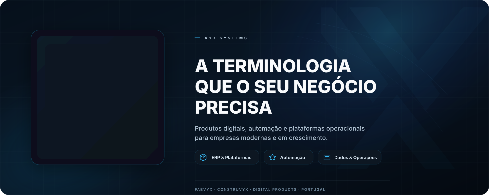

  

  <strong>VYX Systems</strong> é o grupo tecnológico por trás de plataformas operacionais, produtos internos e sistemas digitais criados para tornar empresas mais rápidas, claras e controladas.

  
  
  

---

## Perfil

A VYX funciona como um centro tecnológico e de produto: cada repositório representa um produto, departamento ou fronteira técnica dentro do ecossistema.

O foco é simples: criar sistemas seguros, práticos e escaláveis que ligam operações, automatizam trabalho repetitivo e transformam dados de negócio em decisões.

## Ecossistema

<table>
  <tr>
    <td width="33%">
      <strong>Plataformas operacionais</strong> 
      ERP, backoffice, dashboards e ferramentas de workflow para controlo diário.
    </td>
    <td width="33%">
      <strong>Automação</strong> 
      Processos internos, integrações e serviços que reduzem trabalho manual.
    </td>
    <td width="33%">
      <strong>Dados e inteligência</strong> 
      Relatórios, indicadores e camadas de decisão pensadas para visibilidade rápida.
    </td>
  </tr>
</table>

## Produto em Destaque

### Fabvyx ERP 360

O Fabvyx é uma plataforma ERP moderna para empresas que precisam de gerir vendas, compras, armazém, logística, finanças, produção e inteligência operacional num só lugar.

É construído com uma abordagem 360º: um ecossistema único, várias áreas de negócio, permissões claras, dados fiáveis e uma experiência de utilização limpa.

## Princípios

- **Profissional por defeito:** interfaces limpas, documentação clara e alterações auditáveis.
- **Operacional primeiro:** tecnologia tem de ajudar pessoas a agir mais rápido, não apenas parecer moderna.
- **Segurança e controlo:** sistemas privados, acessos bem definidos e cuidado com dados de negócio.
- **Estrutura escalável:** produtos e repositórios organizados por responsabilidade e caminho de crescimento.

## Modelo de Repositórios

A maioria dos repositórios desta organização é privada e representa trabalho ativo de produto, ferramentas internas, infraestrutura, documentação ou sistemas por departamento.

Os repositórios públicos são usados apenas quando o conteúdo deve estar visível, partilhável ou fazer parte da presença pública da empresa.

## Contacto

- Website: [vyx.pt](https://vyx.pt)
- Email: [dev@vyx.pt](mailto:dev@vyx.pt)
- Localização: Malta

---

  Software proprietário e sistemas internos. Todos os direitos reservados pela VYX Systems.

