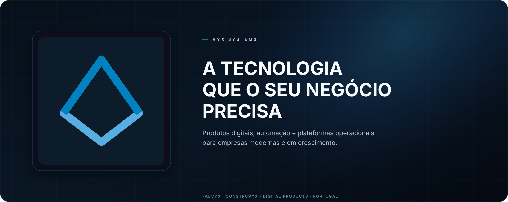

  

  <strong>Sistemas pensados para operações reais.</strong> 
  Criamos produtos digitais, automação e plataformas empresariais 
  que transformam processos complexos em operações simples, ligadas e escaláveis.

  <a href="https://vyx.pt"><strong>Website</strong></a>
  &nbsp;·&nbsp;
  <a href="mailto:dev@vyx.pt"><strong>Falar connosco</strong></a>
  &nbsp;·&nbsp;
  <a href="https://github.com/fabvyx?tab=repositories"><strong>Projetos</strong></a>

---

## Construímos sistemas que trabalham com o seu negócio

Na **vyx Systems**, juntamos produto, engenharia e conhecimento operacional para desenvolver software que resolve problemas concretos.

Da gestão central ao chão de fábrica, desenhamos soluções que ligam pessoas, processos e dados — com foco em clareza, controlo e evolução contínua.

<table>
  <tr>
    <td width="33%" valign="top">
      <h3>Plataformas empresariais</h3>
      
Gestão integrada, processos consistentes e informação útil para decidir com confiança.

    </td>
    <td width="33%" valign="top">
      <h3>Operações e automação</h3>
      
Fluxos digitais, integrações e ferramentas que reduzem tarefas manuais e aproximam a tecnologia da operação.

    </td>
    <td width="33%" valign="top">
      <h3>Produtos digitais</h3>
      
Experiências web, configuradores e soluções à medida, pensadas para criar valor desde o primeiro contacto.

    </td>
  </tr>
</table>

## O ecossistema vyx

### Fabvyx Platform

O núcleo empresarial do ecossistema: uma plataforma ERP industrial que integra comercial, engenharia, produção, compras, armazém, logística, finanças e pós-venda.

[Conhecer a Fabvyx Platform →](https://github.com/fabvyx/fabvyx-platform)

### Fabvyx FloorConnect

A camada operacional local para ambientes industriais. Aproxima máquinas, postos e operadores da plataforma central, com baixa latência, continuidade de serviço e sincronização controlada.

[Conhecer o Fabvyx FloorConnect →](https://github.com/fabvyx/fabvyx-floorconnect)

### Produtos digitais e integrações

Desenvolvemos portais, configuradores 3D, automações e integrações orientadas ao contexto de cada operação — sempre com fronteiras claras, segurança e capacidade de evolução.

## Princípios de engenharia

- **O problema vem primeiro** — tecnologia com propósito e impacto mensurável.
- **Simplicidade operacional** — sistemas claros para quem decide e para quem executa.
- **Segurança desde a origem** — controlo de acesso, auditoria e proteção de dados por desenho.
- **Integração sem dependência** — componentes modulares, contratos explícitos e evolução sustentável.
- **Qualidade contínua** — automação, observabilidade e validação em todo o ciclo de entrega.

---

  <strong>Tem um processo que pode funcionar melhor?</strong> 
  Vamos transformá-lo num sistema preparado para crescer.

  <a href="https://vyx.pt">vyx.pt</a>
  &nbsp;·&nbsp;
  <a href="mailto:dev@vyx.pt">dev@vyx.pt</a>
  &nbsp;·&nbsp;
  Portugal

  © vyx Systems · Software proprietário · Todos os direitos reservados.

